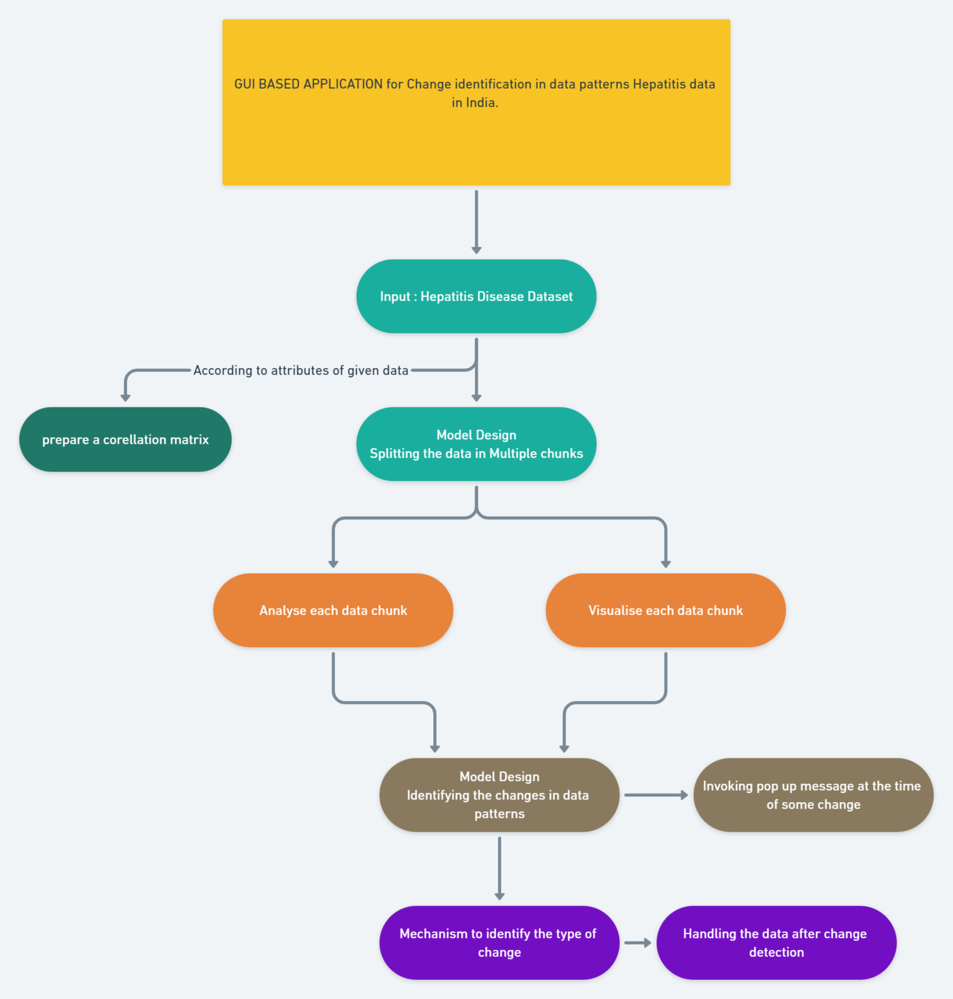
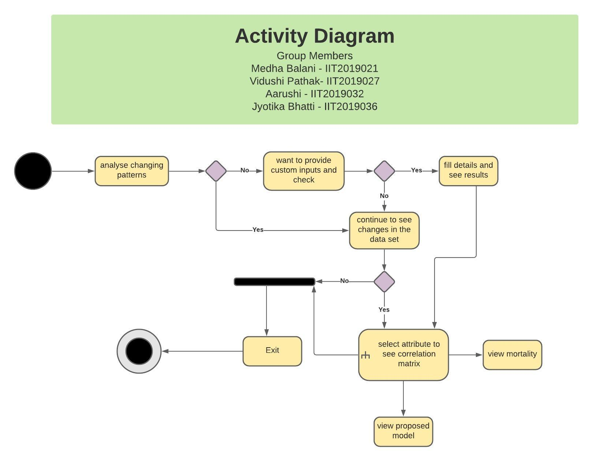

# Software Engineering Project 
## Hepatitis Data Analysis and Visualisation
--------------------------------------------------------------------------------------------------------------------------------------------------
## Features of software
* A Graphical user interface which takes Hepatitis Disease dataset as input.
* Splitting the data in multiple chunks, analyse and visualize each data chunk as a pattern.
* Identification of the changes in data patterns  and  invoke some pop-up msg at the time when there is a change.
* Building a Correlation matrix from the attributes of the given data.
* Computation of Metrics while processing each data attribute
* Prediction of Person surviving or dying acoording to the user input values of different attributes 
* Visualisation of each attribute according to their density curve
* Exploratory DataAnalysis of each attribute on the Dataset

-------------------------------------------------------------------------------------------------------------------------------------------------
## Demo
* [Frontend Workflow](https://drive.google.com/file/d/1wiHDJ_9zvLFE8opaE6Ig1aaaMI-a4AJT/view)
* [Backend Workflow](https://drive.google.com/file/d/1C5DEeCgHXYnc9KxZND1D09qwZo8jq25f/view)


-------------------------------------------------------------------------------------------------------------------------------------------------
## Flow of our Software


--------------------------------------------------------------------------------------------------------------------------------------------------
## About Hepatitis Dataset

The Dataset have the following attribute information
```
Attribute information:
1. Class: DIE, LIVE
2. AGE: 10, 20, 30, 40, 50, 60, 70, 80
3. SEX: male, female
4. STEROID: no, yes
5. ANTIVIRALS: no, yes
6. FATIGUE: no, yes
7. MALAISE: no, yes
8. ANOREXIA: no, yes
9. LIVER BIG: no, yes
10. LIVER FIRM: no, yes
11. SPLEEN PALPABLE: no, yes
12. SPIDERS: no, yes
13. ASCITES: no, yes
14. VARICES: no, yes
15. BILIRUBIN: 0.39, 0.80, 1.20, 2.00, 3.00, 4.00
16. ALK PHOSPHATE: 33, 80, 120, 160, 200, 250
17. SGOT: 13, 100, 200, 300, 400, 500,
18. ALBUMIN: 2.1, 3.0, 3.8, 4.5, 5.0, 6.0
19. PROTIME: 10, 20, 30, 40, 50, 60, 70, 80, 90
20. HISTOLOGY: no, yes
```

--------------------------------------------------------------------------------------------------------------------------------------------------
## Diagrams

<table>
  <tr>
     <td align="center"><br /><sub><b>DFD DIAGRAM</b></sub></a><br /></td>
     <td align="center"><br /><sub><b>ACTIVITY DIAGRAM</b></sub></a><br /></td>
     </tr>
</table>

--------------------------------------------------------------------------------------------------------------------------------------------------
<!--## About each component page
* app.py = 
* app1.py = 
* app2.py
* homepage.py 
* html_profiling.py
* info_About_models.py
* density_of_each_attr.py
* predict.py
*  -->


-------------------------------------------------------------------------------------------------------------------------------------------------
## Technology used

*  Python 3.8 Version
*  Embedded HTML
*  Embedded CSS

--------------------------------------------------------------------------------------------------------------------------------------------------
## Requirements

Install the modules in ```Requirements.txt```
```
streamlit==0.79.0
pandas==1.2.3
matplotlib==3.4.1
numpy==1.20.2
pandas_profiling==2.11.0
plotly==4.14.3
seaborn==0.11.1
streamlit-pandas-profiling==0.1.1
sweetviz==2.1.0
altair==4.1.0
joblib==1.0.1
lime==0.2.0.1
```


--------------------------------------------------------------------------------------------------------------------------------------------------
## Installation Guide Locally

* fork the repo
* git clone [REPO-URL]
* Setup the project in IDE with installed requirements
* Run ``` streamlit run app.py```


--------------------------------------------------------------------------------------------------------------------------------------------------


## Team:
<table>
  <tr>
     <td align="center"><a href="https://github.com/medhabalani"><br /><sub><b>Medha - IIT2019021</b></sub></a><br /></td>
     <td align="center"><a href="https://github.com/vidushi1012"><br /><sub><b>Vidushi - IIT2019027</b></sub></a><br /></td>
    <td align="center"><a href="https://github.com/xxx32"><br /><sub><b>Aarushi - IIT2019032</b></sub></a><br /></td>
     <td align="center"><a href="https://github.com/Jyotika999"><br /><sub><b>Jyotika - IIT2019036</b></sub></a><br /></td>

 
 </tr>
</table>

<!--# Models used for prediction:
1. [Decision Tree Model](https://webfocusinfocenter.informationbuilders.com/wfappent/TLs/TL_rstat/source/DecisionTree47.htm)
2. [KNN MODEL](https://towardsdatascience.com/machine-learning-basics-with-the-k-nearest-neighbors-algorithm-6a6e71d01761)
3. [Logistic Regression](https://towardsdatascience.com/introduction-to-logistic-regression-66248243c148) -->


